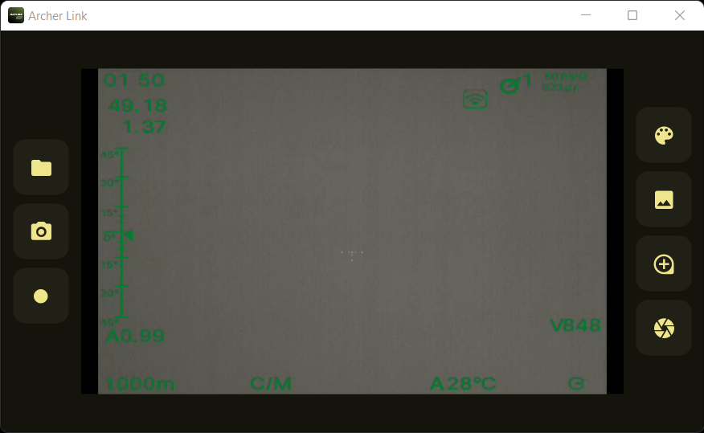

# Archer Link desktop app

> [!IMPORTANT]
> The app is distributed with Python 3.9 x64 bundled.
> It requires the installation of [Microsoft Visual C++ 2015-2019 Redistributable x64](https://learn.microsoft.com/en-us/cpp/windows/latest-supported-vc-redist?view=msvc-170#visual-studio-2015-2017-2019-and-2022).

